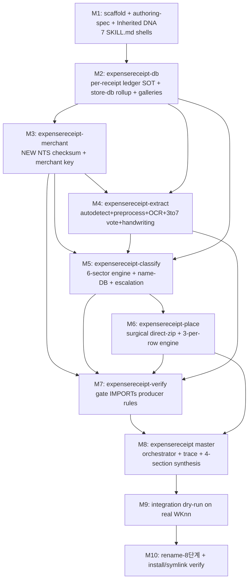

# EXPENSERECEIPT Skill Suite — Milestone-0 Build Plan (명령8)

> **Author**: expensereceipt build worker (ws1/surface:2) · **Date**: 2026-06-20
> **Status**: PLAN ONLY — read-only, zero skill output. Awaiting master milestone-0 approval before any build.
> **Contract SOT**: `EXPENSERECEIPT-SKILL-DESIGN-SPEC.md` (LOCKED). This plan implements that SPEC; it does not change it.
> **Constitution**: EXPTR1 `CLAUDE.md` + `AGENTS.md` + `soul.md` (child-DNA). Identity: DE-MASTER — I am the build worker, not master/CSO.
> **Evidence base**: 10-agent read-only asset survey (639k tokens, 143 tool-uses); digest `/tmp/expr_survey_digest.md`.

---

## 0. Mission Recap (1 paragraph)

Build a **self-learning, owner-private** Claude skill suite — **1 representative + 6 sub-skills**, all prefixed `expensereceipt-` — that reads a week's receipts from a `WKnn_2026` folder (date/store/amount/people/business-number + bottom-handwriting), loads them into a per-receipt DB, classifies into 6 sectors by deterministic rules, anti-hallucination-verifies, and places them onto the Receipt Sheet (3-per-row per sector) via surgical direct-zip. **Maximal reuse of EXPTR1's verified assets; minimal new code.** Quality is the only criterion (절대기준 1); the anti-hallucination verify gate is mandatory and non-skippable (ANCHOR #2a); no guessing/silent winner-pick (ANCHOR #2b).

---

## 1. Survey Synthesis — Asset Reuse Map (the heart of M0)

Strategy legend: **IMPORT** = call existing module as-is · **PORT** = copy file into skill + adapt paths/taxonomy · **REFERENCE** = copy the pattern, not the code · **NEW** = author from scratch.

| # | Existing asset (path under EXPTR1) | Strategy | Consumed by skill | What exactly is reused |
|---|---|---|---|---|
| A | `scripts/extract_card_data.py` | **IMPORT** (parsers) + PORT (CLI) | -extract, -verify, -merchant | `extract_xlsx/extract_xls/normalize_record/parse_date/parse_amount`. Card-row schema `{date,time,amount:int, raw:{사업자번호,가맹점명,가맹점업종,취소여부,...}}`. **Card = spreadsheet `카드승인내역*.xls(x)`, NOT PDF.** |
| B | `scripts/aggregate_ocr_votes.py` | **PORT** verbatim core | -extract | 3→7 adaptive voting; identity key `(date,amount)` time-excluded; `_vote` levels {unanimous/strong/unresolved}; STRONG=ceil(0.8·k); exit 0/2/1 contract. ADAPT only paths + 6-sector list. |
| C | `.claude/skills/wk-receipt-ocr/SKILL.md` | **PORT** (structure) + extend schema | -extract, master | Frontmatter style (424 chars, name+desc only); OCR JSON schema BASE; independence contract; adaptive 3→7 protocol. **Single file, NO references/.** |
| D | `.claude/skills/wk-bbox-detect/SKILL.md` + `scripts/annotate_receipts.py`, `generate_annotations.py` | PORT (guard) + REFERENCE | -extract (vision), -verify, -place | `validate_bbox_counts`+`_run_bbox_guard` → PORT into -verify (producer-rules-imported-by-verifier pattern). Anti-hallucination caps {0,2}-strict, global cap 80. exit-10 vision-HALT pattern. |
| E | `scripts/build_store_db.py` + `planning/store-db.json` | **IMPORT/PORT** + **NEW checksum** | -merchant, -db, -classify, -verify | `norm_store`, `_biz_no` (extractor), `match_card` (consume join), `receipt_key`, `build()` aggregator, **quarantine→snapshot→promote→rollback** transaction layer. store-db schema. **⚠ NTS 10-digit checksum = NEW (grep-confirmed absent).** |
| F | `scripts/annotate_receipts.py` (NOT write_excel.py) | **PORT** skeleton + **NEW** branches | -place | `inject_shapes`/`_parse_image_anchors`/`_clone_rdr_shape`/`_get_max_shape_id` = the surgical direct-zip technique (lxml mutate one `drawingN.xml` → rewrite zip verbatim → `os.replace`). **It injects `<sp>` shapes; image `<pic>`+rels+media branches = NEW.** |
| F2 | `scripts/write_excel.py` | PORT primitives | -place, -extract, -classify | `_get_receipt_image_anchors` ROW_GAP_THRESHOLD=30 row-group-then-col sort (the "3-per-row, fill-then-down" ordering primitive); `detect_receipt_positions` (sector row bands); `read_name_database`/`_get_name_db_row_range`/`format_names_string` (name-DB). **Cell-value writes via openpyxl OK; image anchors via openpyxl FORBIDDEN.** |
| G | `scripts/verify_week.py` + `verify_card_matching.py` + `verify_toll_integrity.py` + `verify_ocr_consistency.py` + `verify_formula_integrity.py` | **PORT** skeleton + leaf checks; IMPORT producer rules | -verify | `Result`/`add()→SKIP`/verdict/exit-0-1/JSON-report gate runner; `reconcile` (consume (date,amount) card cross-match); toll T-3 (amount≠0); `compare` (Counter set-diff consensus); `check` (cell/formula preservation). |
| H | `scripts/run_week.py` + `.claude/commands/wk.md` | **PORT** orchestrator design | master (`expensereceipt`) | Stage-table-as-list-of-dicts w/ `done()`/`vision_check()` lambdas; driver loop; exit-code routing (0/10/1/20); `emit()`+`_flush()` = orchestration trace; subprocess+exit-code sub-step contract (anti-hallucination). |
| I | `scripts/classify_section.py` + `classify_stage.py` | **IMPORT/PORT** | -classify | `classify()` 3-tier store→sector (T1 conf≥0.85 auto; headcount≥3→TRAVEL; T3 escalate); re-entrant human-escalation HALT (write `section-confirmed.json` → re-run). |
| J | name-DB inside workbook `Receipt!A999:H1007` | IMPORT via `read_name_database` | -classify, -db, -place | Row 999 company headers (A=TERADYNE, D=SAMSUNG EDS, G=SAMSUNG HBM PE); names 1000+; **DYNAMIC range** (not hardcoded 1007). **Company-column = sector: TERADYNE→STAFF, SAMSUNG-family→TRAVEL.** |
| K | foresight-env-scan suite + `workflow-generator/references/` | **PORT** authoring template | all 7 | 3-layer `[TLDR]/[TRIGGERS]/[METHODOLOGY]` desc; master-invocable + sub `disable-model-invocation:true`; §F body skeleton; **`## Inherited DNA` 9-row genome table** + `parent_genome` SOT block. |

**Net-NEW code inventory** (the only things written from scratch — minimized per SPEC):
1. NTS 10-digit business-number checksum (-merchant). Algorithm: weights `[1,3,7,1,3,7,5,1,3]`, 9th digit ×5 → take tens digit, sum all, `(10 − sum%10)%10 == 10th digit`.
2. Folder autodetect + file-kind classification (receipt vs `카드승인내역` vs template) + split + preprocess (deskew/rotation/thermal) (-extract) — **no existing pixel-preprocessing to port**.
3. OCR schema extension fields: `사업자번호`, dinner-level `people` (via main-item count), `맨밑필기` (bottom handwriting) (-extract).
4. Item-sum == card-amount line-item summation (-verify req#3).
5. Handwriting-confidence check + handwriting self-learning gallery (few-shot) (-extract/-db, req#5).
6. `<pic>`-anchor + rels + media injection branches on top of the ported `inject_shapes` skeleton (-place).
7. The 3-per-row / sector-grouping **placement-coordinate engine** (-place) — did not exist; built at M6. *(row insertion on overflow: NOT implemented → fail-loud / ESCALATE — see G7, §11.)*
8. OTHERS-LOCAL sector cell-group (-place/-classify) — no existing analog.

---

## 2. Build Order & Dependency Graph

Producer-before-consumer; verify after its producers (it IMPORTs their rules); master last.



Rationale: `-db` is the data backbone (defines the SOT). `-merchant` produces the checksum rule that `-verify` and `-classify` consume. `-extract` and `-classify` feed `-place`. `-verify` IMPORTs producer rules from -merchant/-classify/-place, so it is built after them. The master orchestrates everything, built last.

---

## 3. Per-Skill Build Plan

### 3.1 `expensereceipt-db` (M2) — det
- **Responsibility**: per-receipt ledger `{store,date,amount,people,handwriting}` (the SPEC §3 schema, finer than existing store-db); roll-up to store-db aggregate; handwriting self-learning gallery (crop↔confirmed-text pairs, few-shot source); classification-learning DB. Defines the **SOT/state** with `parent_genome` block.
- **Reuse**: PORT `build()` aggregator + `quarantine→snapshot→promote→rollback` (E) — the no-pollution, human-confirmed growth mechanism, reused for BOTH ledger and gallery. IMPORT `normalize_record`/`parse_date` (A).
- **Outputs**: `planning/expensereceipt/ledger.json` (per-receipt), `store-db.json` rollup, `gallery/` (handwriting), `classify-db.json`. **Single-writer = master** (절대기준 2).
- **Verify (실측)**: `python3 -c` round-trip ledger write/read; quarantine→promote→rollback dry cycle leaves DB identical on rollback; schema keys present.
- **★Binding (M0)**: **G10** — handwriting gallery few-shot selection by **metadata key (store / weekday / time-band), NOT pixel similarity** (no CV2/numpy); never dump the full gallery (context explosion). Gallery growth reuses the `quarantine→promote→rollback` safe-append pattern.

### 3.2 `expensereceipt-merchant` (M3) — det
- **Responsibility**: NTS 10-digit checksum validation + merchant key + store-name normalization.
- **Reuse**: IMPORT `_biz_no` (extractor) + `norm_store` + `match_card` + `receipt_key` (E). **NEW**: checksum validator wrapping `_biz_no` (strip hyphens from `'217-81-14493'` first).
- **Outputs**: merchant-key + checksum verdict per receipt; producer rule `validate_biz_no()` that `-verify` IMPORTs.
- **Verify (실측)**: checksum unit-tested against known-valid card biz-numbers from real `카드승인내역` files (must PASS) and against corrupted ones (must FAIL). Confirm hyphen-stripping.
- **★Binding (M0)**: **G3** — read card `raw` keys **best-effort + NFC-normalized** (probe `사업자번호`↔`사업자등록번호` both, as `_biz_no` already does); no hardcoded key access (avoid silent KeyError / garbage-in).

### 3.3 `expensereceipt-extract` (M4) — LLM+det
- **Responsibility**: folder autodetect/split/preprocess + vision OCR (store/date/amount/**people**/**business-number** + **bottom-handwriting** w/ gallery few-shot) + multi-read 3→7 voting.
- **Reuse**: PORT `aggregate_ocr_votes.py` (B) verbatim core; PORT `wk-receipt-ocr` SKILL.md schema BASE + independence contract (C); REFERENCE bbox vision-HALT pattern (D). **NEW**: folder/file-kind autodetect (receipt vs `카드승인내역` vs template, NFC-normalized), preprocess stage, schema extension (사업자번호/dinner-people/맨밑필기).
- **Two distinct vision HALTs**: OCR read; bottom-handwriting read. Both exit-10 re-entrant.
- **Verify (실측)**: run voting on 3 synthetic reads → consensus exit 0; on a mismatch → exit 2; identity key excludes time. Folder autodetect correctly classifies real `WK23_2026/` contents.
- **★Binding (M0)**: **Q1** input default = `raw-data/input/WKnn_2026/` (owner-confirmed; `~/WKww_YYYY` overridden — keep only an optional configurable alias). **G11** preprocess minimized to **simple rotation + grayscale only** (no Hough deskew / thermal pipeline — trust Claude Vision skew/low-light reading). **G10** inject store-matched few-shot from the gallery by metadata key. **G3** card-`raw` key probing best-effort + NFC. NFC-normalize all folder/file name matching (macOS NFD trap).

### 3.4 `expensereceipt-classify` (M5) — det+LLM+human
- **Responsibility**: 6-sector rule engine (SPEC §2 priority order) + Dinner LLM-probability + STAFF/TRAVEL name selection (human-confirmed via master).
- **Reuse**: IMPORT `classify_section.classify` (I) + `read_name_database` (J). **Key insight**: STAFF↔TRAVEL split = which A999 company-column the name sits in (TERADYNE=STAFF / SAMSUNG EDS·HBM-PE=TRAVEL). PORT `classify_stage.py` escalation-HALT (write `section-confirmed.json` → re-run) — this is the SPEC's "silent winner-pick 금지 → escalation".
- **NEW**: OTHERS-LOCAL fallback; people-count inference (main-item count, options excluded) with `item-sum==card-amount` cross-check.
- **Verify (실측)**: deterministic triggers ("기간별 사용 내용"→PARKING/TOLLS, "T world"→TELEPHONE) fire correctly; ≥2-no-handwriting routes to escalation (never silent).
- **★Binding (M0)**: **G9** STAFF(a) "already 1 Dinner registered" = **SAME-DATE scope** (1 personal dinner/day + same-day extra meal → STAFF; week-wide scope would misclassify later days' solo dinners). **G2** name-DB via **dynamic reader only** (`read_name_database` / `_get_name_db_row_range`); **never** port the hardcoded `range(999,1008)` 1007-ceiling (write_excel.py:893-916). **G5** `section-confirmed.json` is written by **master/human between runs**, NOT this sub-skill (it only predicts → `section-predictions.json`, then HALT). **Solo-lunch flag (gemini #4)**: no-handwriting / 1-person / lunch → stays **OTHERS-LOCAL** per SPEC; TRAVEL-rescue would be a SPEC extension (owner decides) — re-confirm with owner at M5.

### 3.5 `expensereceipt-place` (M6) — det
- **Responsibility**: Receipt Sheet placement — 3 per row per sector, fill then down within the template's pre-sized sector bands; true overflow → ESCALATE (insert-row not implemented — see G7). Surgical direct-zip, twoCellAnchor, openpyxl FORBIDDEN.
- **Reuse**: PORT `annotate_receipts.py` (F) surgical-zip skeleton + `_get_receipt_image_anchors` ROW_GAP_THRESHOLD=30 ordering + `detect_receipt_positions` (F2). **NEW**: `<pic>`-anchor emission + rels-write (`rId→../media/imageN`) + media-bytes-write branches; the 3-per-row/sector coordinate engine (insert-row NOT implemented — fail-loud/ESCALATE, G7); OTHERS-LOCAL cell-group.
- **Verify (실측)**: PORT `verify_week._zip_drawing_counts` → injected `<pic>` count == receipt count, twoCellAnchors preserved, file opens in Excel without repair. No openpyxl touches the file after placement.
- **★Binding (M0)**: **G7** insert-row — *delivered status (M6 post-§5 hardening)*: a formula-aware row shift (`<row r>`+`<c r>`+`<f>`+`mergeCells`+anchors atomically) across the template's 1555 formulas is a genuine ceiling-explosion risk and is **NOT implemented**; `insert_rows_lxml` is **fail-loud** (raises — no silent partial shift). **openpyxl insert FORBIDDEN**. **Primary strategy = the template's pre-sized sector bands** (placement fits without inserting); true overflow → `plan_insert_rows` ESCALATE sentinel → **master decides** (pre-sizing vs. calibrated hybrid). `physical_verify` asserts `row_cell_consistency` as a desync backstop. **G8** operate on a **candidate output file**; adopt via atomic `os.replace` **only after** post-placement PHYSICAL verify PASS; on failure discard candidate (rollback) + escalate. Input `raw-data/input/` immutable; output **only** to `raw-data/output/`. **G2** dynamic name-DB reader only. **Q4** inspect the real template for an OTHERS-LOCAL cell-group here.

### 3.6 `expensereceipt-verify` (M7) — det, read-only ★ANCHOR #2a
- **Responsibility**: mandatory anti-hallucination gate. 7 checks: (1) biz-checksum, (2) card (date,amount) match, (3) item-sum==card-amount, (4) amount≠0, (5) handwriting-confidence, (6) multi-read consensus, (7) rule consistency.
- **Reuse**: PORT `verify_week.py` gate-runner skeleton (G); IMPORT leaf checks `reconcile`(#2), toll-T3 generalized(#4), `compare`(#6); IMPORT producer rules from -merchant(checksum #1), -classify(rules #7), -place(`_zip_drawing_counts`). **NEW**: item-sum summation(#3), handwriting-confidence(#5). **Drop the openpyxl FAIL.xlsx writer → emit JSON only (strict read-only).**
- **Discipline**: read-only, deterministic, IMPORT-never-reimplement. On fail → re-read flagged only (max 2) → escalate. Two-tier severity (violation=exit1, warning=exit0).
- **Verify (실측)**: feed a known-bad receipt (amount=0, checksum-fail, card mismatch) → each violation caught with exit 1; a clean week → exit 0.
- **★Binding (M0)**: **G6** expose **two entry points** — (a) pre-placement **LOGICAL** verify (checksum, card cross-match, item-sum==card, amount≠0, consensus, handwriting-confidence — no placed file needed) run **before** place; (b) post-placement **PHYSICAL** verify (zip drawing count, anchor preservation, no-repair open) run **after** place. **G1** canceled rows: robustly detect the cancel column/value (`취소여부`='Y' / '취소' etc., NFC), **key-absent ⇒ not-canceled** (Q2: exclude canceled from card cross-match — ANCHOR #2b). **G4** req#6 consensus = consume `ocr-vote-audit.json` (from `aggregate_ocr_votes`), **NOT** `verify_ocr_consistency.compare` (that is dual-read pairwise diff only). **G3** card-`raw` keys best-effort + NFC. **Q5 / read-only** enforced by **code** (0 file writes, JSON only); **drop** verify_card_matching's openpyxl `*_FAIL.xlsx` writer. **Caveat**: re-wire leaf checks as in-process **IMPORT** (pure module-level fns) but satisfy each leaf's input signature + strip verify_week's hardcoded `OUTPUT_DIR`/`research`/`planning` layout deps.

### 3.7 `expensereceipt` (M8) — master, LLM
- **Responsibility**: orchestration + **orchestration trace** (발동 cycle / sub call order+timing / per-sub output isolation / 4-section synthesis) + master-owned SOT single-write + owner interaction (name-select / handwriting-confirm / escalation).
- **Reuse**: PORT `run_week.py` (H) stage table + driver loop + exit-code routing + `emit()`/`_flush()` trace. Subprocess + exit-code contract per sub-skill. HALT for OCR / handwriting / name-selection.
- **Verify (실측)**: dry-run emits full PLAN trace; re-entrancy resumes from disk artifacts; HALT prints machine-followable handoff at every exit-10.
- **★Binding (M0)**: **G6** enforce ordering — `-place` mutates the output Excel **only after** the pre-placement LOGICAL verify PASSes; then run post-placement PHYSICAL verify. **G5** orchestrator surfaces the classify HALT handoff and **master/human writes `section-confirmed.json`** between runs, then re-run resumes (sub-skills never self-write it). Trace each sub-skill call (subprocess + exit code = anti-hallucination).

---

## 4. SKILL.md Authoring Template + Inherited DNA (genome embedding)

Established from the foresight-env-scan suite + EXPTR1 `workflow-template.md` (asset K).

- **Master `expensereceipt`**: frontmatter = `name` + `description` only (model-invocable, NO `disable-model-invocation`).
- **6 sub-skills**: `name` + `description` + `disable-model-invocation: true`; name == folder name == `expensereceipt-<role>`.
- **Description**: 3-layer `[TLDR] / [TRIGGERS] / [METHODOLOGY]`, **≤ 1024 chars** (hard cap). Keep [TLDR]+[TRIGGERS] full; compress [METHODOLOGY] to a one-line pointer; full detail → SKILL.md body. (Proven: wk-receipt-ocr=424 chars.)
- **Body §F skeleton** (all 7): `## Overview (WHY)` / `## When to Use / Invocation` / `## Methodology (cite references/)` / `## AI-Agent Automation` / `## Inputs / Outputs (data contract + SOT fields)` / `## Inherited DNA (Parent Genome)` / `## References`.
- **`## Inherited DNA (Parent Genome)`**: 3 Constitutional Principles (Quality Absolutism / Single-File SOT / CCP) contextualized to receipt-OCR + a 9-row Inherited-Patterns table (절대기준3, SOT, 3단계, 4계층 검증, P1 봉쇄, Safety Hook, Adversarial Review, Decision Log, Context Preservation) + a Gene-Expression note (P1 + 4-layer QA express strongest — the verify gate is the dominant gene; -place expresses CCP §3 via openpyxl-forbidden surgical-zip).
- **SOT** carries `parent_genome: {source: AgenticWorkflow, version: <build-date>, inherited_dna: [...]}`.
- **Deliverable**: `references/authoring-spec.md` (suite build contract) — created in M1.
- **`allowed-tools`**: NOT house style; only consider for `-verify` to enforce read-only (NEW convention, flag before adopting).

---

## 5. Milestone Roadmap

| M | Title | Deliverable | Gate (master + §5 + 실측) |
|---|---|---|---|
| **M0** | Build plan | this doc + WORKER_TODO + ACK | master approval to start |
| **M1** | Clean setup + scaffold | 7 skill dirs, `references/authoring-spec.md`, 7 SKILL.md shells (frontmatter + Inherited DNA + §F skeleton) | DNA-inheritance check; frontmatter↔folder name |
| **M2** | `-db` | ledger SOT + rollup + galleries | round-trip + rollback 실측 |
| **M3** | `-merchant` | NTS checksum + key | checksum unit tests (valid/invalid) |
| **M4** | `-extract` | autodetect+OCR+vote+handwriting | voting exit-code 실측; autodetect on WK23 |
| **M5** | `-classify` | 6-sector engine + name-DB | trigger 실측; escalation (no silent) · **§5 gemini** |
| **M6** | `-place` | surgical-zip + 3-per-row | `_zip_drawing_counts` 실측; Excel opens clean · **§5 gemini** |
| **M7** | `-verify` | 7-check gate | bad-receipt catch 실측 · **§5 gemini (ANCHOR #2a)** |
| **M8** | `expensereceipt` master | orchestrator + trace | dry-run trace; re-entrancy 실측 |
| **M9** | Integration dry-run | end-to-end on real WKnn | HALT loop completes; all gates PASS |
| **M10** | rename-8단계 + install | symlink/project-scope, cross-links | discovery + disable-model-invocation stable |

Each milestone: **build → 실측 self-verify → push master → master verify + §5 dialectic + approval → next.** No skipping; errors fixed to completion (autopilot, 인내심). denylist (§4) → stop + push.

---

## 6. Verification Plan (품질 절대우선)

- **Per-skill 실측**: every script validated by `python3 -c` import + actual run on real data BEFORE reporting ("확인했다", not "될 것이다"). `node --check` n/a (Python suite).
- **4계층 적용** (DNA): L0 file-exists+size on each skill output; L1 the skill's own Verification criteria; L1.5 pACS self-rating per milestone; L2 = `-verify` gate + gemini adversarial review on high-risk skills.
- **Integration (M9)**: run the full HALT→vision→re-run loop on a real `WKnn_2026`; assert each exit-code transition; final `-verify` exit 0.
- **Regression anchors from survey**: voting S1-S4 cases (esp. S4 systematic-wrong caught by verify); bbox over-generation cap 80; openpyxl-forbidden anchor-preservation.

---

## 7. §5 External Dialectic Plan (gemini + master)

- **gemini = ws1/surface:4** (codex unavailable until Jul 18 — excluded; master runs own Workflow adversarial pass to fill the 3rd seat).
- **Mandatory gemini adversarial review** at: **M5** (classify rules), **M6** (place surgical-zip), **M7** (verify gate — ANCHOR #2a). Round loop: review → vindication → counter → accept-if-sound, McKinsey-grade / up to 10R. Appendix-A strict-constraint preamble attached to every gemini request.

---

## 8. Open Questions / SPEC Discrepancies — flag to master (ANCHOR #3, do not guess)

1. **Input path**: SPEC §6 says `~/WKww_YYYY/`; real convention is `<project>/raw-data/input/WKnn_2026/` (where all data + existing pipeline live). **Reasonable assumption**: build for `raw-data/input/WKnn_2026` as primary, accept a configurable `~/WKww_YYYY` alias; NFC-normalize folder match. → confirm.
2. **Canceled card rows (`취소여부=='Y'`)**: existing `extract_card_data` does NOT filter them. **Reasonable assumption**: `-verify` excludes canceled transactions from card cross-match (a canceled charge must not reimburse). → confirm.
3. **SPEC §7 asset-name correction** (not a scope change): surgical-zip lives in `annotate_receipts.py` (not `write_excel.py`), and injects `<sp>` not `<pic>` — image placement branches + 3-per-row engine are net-new. Within-roadmap; proceeding unless told otherwise.
4. **OTHERS-LOCAL sector**: no existing workbook cell-group. Does the target template already contain an OTHERS-LOCAL section, or must `-place` create one? → inspect template at M6; flag now as a known build risk.
5. **`allowed-tools` on `-verify`**: adopt a NEW (non-house-style) read-only restriction to enforce the gate? → confirm preference.

> **✅ RESOLVED at M0 approval (2026-06-20, master verdict)**: **Q1** = `raw-data/input/WKnn_2026/` (owner-confirmed; SPEC §6 `~/WKww_YYYY/` overridden). **Q2** = exclude canceled rows from card cross-match (via **G1** defensive detection). **Q3** = within-roadmap (annotate_receipts.py correction), proceeding. **Q4** = inspect template at M6. **Q5** = read-only enforced by **code** (JSON-only, 0 writes); `allowed-tools` adopted only if it does not break the subprocess contract, else omitted. **Solo-lunch (gemini #4)**: stays OTHERS-LOCAL per SPEC; TRAVEL-rescue = SPEC extension (owner decides), re-confirm at M5. Full binding guardrails → **§11**.

---

## 9. Risks & Safety (denylist §4 honored)

- **openpyxl FORBIDDEN** for image/anchor writes (destroys twoCellAnchor — empirically proven); cell-value reads/writes OK. Last openpyxl use = formula restore; everything after = lxml/direct-zip only.
- **NFD/NFC** macOS Korean filenames + in-cell headers → always `unicodedata.normalize('NFC', …)` before matching (replicate `extract_images.find_card_file`).
- **Garbage-in block (ANCHOR #2b)**: never fill store/date/amount/people/biz-no/handwriting by guess; low confidence → escalation, never silent winner-pick.
- **Reuse safety (denylist ⑤)**: existing verified scripts reused by IMPORT/PORT(copy); **original files not modified**. If a producer-rule edit becomes necessary → `.bak` backup + master approval.
- **No git / no external send / no irreversible delete**; new files only (namespaced to avoid overwriting the WK23 thread's `WORKER_TODO.md`).
- **SOT single-writer** = master; sub-skills RETURN; `-verify` read-only.

---

## 10. Clean-Setup Plan (M1)

```
.claude/skills/
  expensereceipt/                 (master: SKILL.md only, model-invocable)
  expensereceipt-extract/         (SKILL.md + scripts/ + references/)
  expensereceipt-merchant/        (SKILL.md + scripts/)
  expensereceipt-classify/        (SKILL.md + scripts/)
  expensereceipt-verify/          (SKILL.md + scripts/)
  expensereceipt-place/           (SKILL.md + scripts/)
  expensereceipt-db/              (SKILL.md + scripts/)
  expensereceipt/references/authoring-spec.md   (suite build contract)
planning/expensereceipt/          (runtime SOT/ledger/galleries — gitignored runtime)
```

Reused scripts are COPIED into each skill's `scripts/` (or imported via `sys.path` to the shared `scripts/` dir — decided per skill at build time to keep skills independently runnable). Project-scope first; user-scope symlink + discovery re-validated at M10 rename-8단계.

---

## 11. Binding Guardrails (master M0 approval — 2026-06-20) ★BINDING

> Independent verification: master Workflow (7 agents · CONFIRMED 14 / REFUTED 0 / PARTIAL 8 · build-misleading errors 0) + gemini §5 (REVISE→정밀화 6). Surgical-zip correction confirmed in 4/4 real files. These are **binding** on the named milestones; each is also embedded in the per-skill spec (§3) as **★Binding (M0)**.

**Decisions:** Q1 input = `raw-data/input/WKnn_2026/` (owner-confirmed, overrides `~/WKww_YYYY/`). · Q2 canceled card rows excluded from `-verify` cross-match (via G1). · Q4 OTHERS-LOCAL template check at M6. · Q5 read-only enforced by code (JSON-only, 0 writes); `allowed-tools` only if subprocess contract intact.

| G | Milestone(s) | Skill | Binding rule |
|---|---|---|---|
| **G1** | M7 | -verify | Canceled-row **defensive** detection — no `취소여부`-key assumption; raw = generic `record.items()` passthrough; robustly detect cancel column/value, **key-absent ⇒ not-canceled** (ANCHOR #2b). |
| **G2** | M5/M6 | -classify/-place | name-DB via **dynamic reader only** (`read_name_database`/`_get_name_db_row_range`); **do NOT** port hardcoded `range(999,1008)` 1007-ceiling (write_excel.py:893-916). |
| **G3** | M3/M4/M7 | -merchant/-extract/-verify | Card `raw` keys **best-effort + NFC** probe (`사업자번호`↔`사업자등록번호`); no hardcoded key access (no silent KeyError / garbage-in). |
| **G4** | M7 | -verify | req#6 consensus = consume `ocr-vote-audit.json` (aggregate_ocr_votes); `verify_ocr_consistency.compare` is dual-read pairwise diff only, **not** N-read consensus. |
| **G5** | M5/M8 | -classify/master | `section-confirmed.json` is written by **master/human between runs**; classify only predicts (`section-predictions.json`) + HALT. Orchestrator surfaces handoff; sub-skill never self-writes it. |
| **G6** | M7/M8 | -verify/master | Runtime verify **2-split**: (a) pre-placement LOGICAL before place; (b) post-placement PHYSICAL after place. Place mutates output Excel **only after** logical PASS. `-verify` exposes both entry points. |
| **G7** | M6 | -place | insert-row formula-aware shift **NOT implemented → fail-loud** (`insert_rows_lxml` raises; partial shift would silently desync `<c r>`/`<f>` vs `<row r>`). openpyxl-insert FORBIDDEN. **Primary = template pre-sized sector bands**; true overflow → `plan_insert_rows` ESCALATE → master. `physical_verify` asserts `row_cell_consistency`. *(hardened after the M6 §5 adversarial review)* |
| **G8** | M6 | -place | Candidate-output + atomic `os.replace` only after post-physical-verify PASS; failure ⇒ discard + escalate. Input immutable; output only `raw-data/output/`. |
| **G9** | M5 | -classify | STAFF(a) "already 1 Dinner registered" = **SAME-DATE scope** (avoid week-wide misclassification of later solo dinners). |
| **G10** | M2/M4 | -db/-extract | Gallery few-shot by **metadata key** (store/weekday/time-band), not pixel similarity (no CV2/numpy); no full-gallery dump. |
| **G11** | M4 | -extract | Preprocess **minimized** to simple rotation + grayscale; no Hough deskew / thermal pipeline (trust Vision; net-NEW minimal). |
| **Caveat** | M7 | -verify | Re-wire verify_week leaf checks as in-process **IMPORT** (pure module-level fns); satisfy each leaf signature + strip hardcoded `OUTPUT_DIR`/`research`/`planning` layout deps. |

**Owner FLAG (non-blocking, M5):** solo lunch (no-handwriting/1-person/lunch) stays **OTHERS-LOCAL** per current SPEC; a TRAVEL-rescue rule = SPEC extension (owner decides). Re-confirm at M5.

**§5 seat:** codex out (quota, until Jul 18) → M0 dialectic ran with gemini + master Workflow (2 seats, consciously accepted). M5/M6/M7 high-risk gates keep **mandatory gemini adversarial review**.
