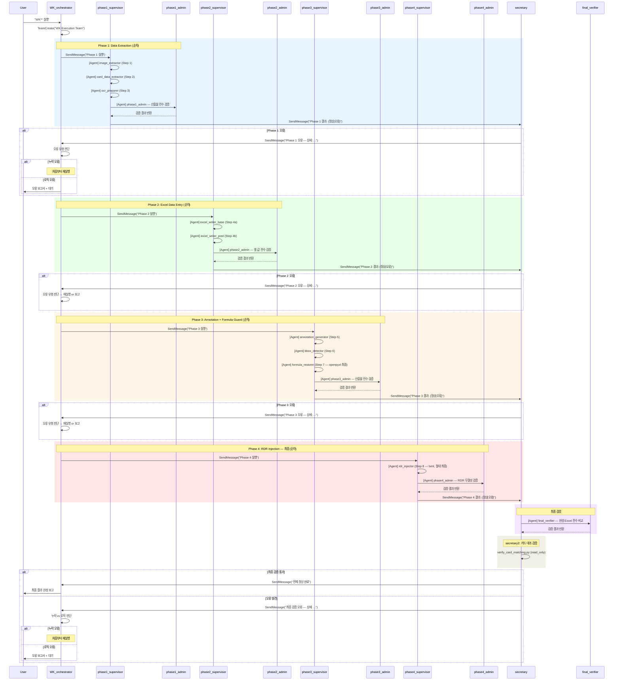

# WK_workflow Agent System 설계 보고서 (v2 — 완전 순차 실행)

> 작성일: 2026-03-07
> 대상: WK_workflow.md (Expense Report Automation)
> 목적: 사용자 요구사항 15개 항목 기반 에이전트 계층 설계
> 변경: v1 대비 **모든 병렬화 제거**, 완전 순차 실행으로 단순화

---

## 1. 설계 원칙: 완전 순차 실행

### 1.1 병렬화를 제거한 이유

1. **이득 부재**: 스크립트 실행 시간이 각 0.5~2초. Agent 생성 오버헤드가 병렬화 절약분보다 크다.
2. **오류 추적 단순화**: 실패 지점이 항상 하나. 공유 자원 경합 원인 분석이 불필요하다.
3. **프로세스 중지 완전 구현**: 순차 실행에서는 "중지 = 다음 단계 미시작"이므로, secretary의 중지 권한(요구사항 ⑨)이 완벽하게 동작한다.

### 1.2 실행 순서 (8단계 단일 체인)

```
Step 0 → Step 1 → Step 2 → Step 3 → Step 4a → Step 4b → Step 5 → Step 6 → Step 7 → Step 8
  │         │         │         │         │          │         │         │         │        │
  ▼         ▼         ▼         ▼         ▼          ▼         ▼         ▼         ▼        ▼
OCR      extract   extract   OCR      write      write    generate   bbox    formula    RDR
clear    images    card      create   --base     --post   annotate   detect  restore   inject
```

각 단계 완료 후 → supervisor가 admin에게 검증 위임 → secretary에 보고 → 이상 시 즉시 중지.

---

## 2. 에이전트 계층 설계

### 2.1 전체 아키텍처

```
WK_orchestrator (메인 세션 — 사용자와 직접 대화)
│
│  ① orchestrator가 TeamCreate로 팀 생성
│  ② orchestrator가 SendMessage로 supervisor에게 Phase 실행 지시
│  ③ 각 supervisor는 Agent tool로 sub-agent를 순차 호출
│  ④ 각 supervisor는 Agent tool로 admin을 호출하여 결과 검증
│  ⑤ supervisor가 SendMessage로 secretary에게 결과 보고
│  ⑥ secretary가 SendMessage로 orchestrator에게 최종 보고
│
├── [TeamCreate] ─── WK Execution Team ──────────────────────
│   │
│   ├── secretary0  (OCR 초기화 — Step 0, 가장 먼저 실행)
│   │   └── 기존 ocr-results.json + wk**_ocr-results.json 삭제
│   │
│   ├── phase1_supervisor  (Data Extraction)
│   │   ├── [Agent] → image_extractor      (Step 1)  순차
│   │   ├── [Agent] → card_data_extractor  (Step 2)  순차
│   │   ├── [Agent] → ocr_preparer         (Step 3)  순차 (항상 새로 생성)
│   │   └── [Agent] → phase1_admin         (검증)
│   │
│   ├── phase2_supervisor  (Excel Data Entry)
│   │   ├── [Agent] → excel_writer_base    (Step 4a) 순차
│   │   ├── [Agent] → excel_writer_post    (Step 4b) 순차
│   │   └── [Agent] → phase2_admin         (검증)
│   │
│   ├── phase3_supervisor  (Annotation + Formula Guard)
│   │   ├── [Agent] → annotation_generator (Step 5)  순차
│   │   ├── [Agent] → bbox_detector        (Step 6)  순차
│   │   ├── [Agent] → formula_restorer     (Step 7)  순차
│   │   └── [Agent] → phase3_admin         (검증)
│   │
│   ├── phase4_supervisor  (RDR Injection — 최종)
│   │   ├── [Agent] → rdr_injector         (Step 8)  순차
│   │   └── [Agent] → phase4_admin         (검증)
│   │
│   ├── secretary  (최종 검증 + 오류 라우팅)
│   │   └── [Agent] → final_verifier       (완성 Excel 전수 비교)
│   │
│   └── secretary2  (카드 대조 검증 — secretary 이후, orchestrator 보고 이전)
│       └── 실행: verify_card_matching.py (read_only=True, save 금지)
│
└── [사용자 대화] ← 오류 보고서 / 완료 보고
```

### 2.2 에이전트별 역할 정의 (17개)

#### 제어 계층 (6개 — Team 멤버)

| Agent | 역할 | 도구 |
|-------|------|------|
| **WK_orchestrator** | 전체 실행 순서 제어. Phase 간 게이트. 오류 판단(누락 vs 로직). 사용자 보고 | 전체 |
| **secretary0** | OCR 데이터 초기화 (Step 0). 기존 ocr-results.json + 백업 삭제. **가장 먼저 실행** | Bash |
| **phase1_supervisor** | Step 1→2→3 순차 실행. admin에 검증 위임. secretary에 보고 | Agent, SendMessage, Bash |
| **phase2_supervisor** | Step 4a→4b 순차 실행. admin에 검증 위임. secretary에 보고 | Agent, SendMessage, Bash |
| **phase3_supervisor** | Step 5→6→7 순차 실행. admin에 검증 위임. secretary에 보고 | Agent, SendMessage, Bash |
| **phase4_supervisor** | Step 8 실행. admin에 검증 위임. secretary에 보고 | Agent, SendMessage, Bash |
| **secretary** | 전 Phase 결과 종합 검증. 오류 분류(누락/로직). orchestrator에 보고. 이상 시 즉시 중지 | Agent, SendMessage, Read, Bash |
| **secretary2** | 카드 승인 내역 1:1 전수 대조 (secretary 이후). MISMATCH 시 FAIL 보고서 생성 | Bash, Read |

#### 검증 계층 (4개 — Sub-agent)

| Agent | 역할 | 도구 | 검증 대상 |
|-------|------|------|----------|
| **phase1_admin** | Phase 1 산출물 전수 검증 + §8-1 대원칙 검증(OCR 항목이 Receipt 영수증 사진에 대응하는지 확인) | Read, Bash, Grep | `input-manifest.json`, `card-approval-data.json`, `ocr-results.json` |
| **phase2_admin** | Phase 2 산출물 전수 검증 | Read, Bash, Grep | 출력 Excel 셀 값 vs OCR/카드 데이터, `cell-mapping.json` |
| **phase3_admin** | Phase 3 산출물 전수 검증 | Read, Bash, Grep | `wk**-template.json`, `wk**.json`, 수식 복원 결과 |
| **phase4_admin** | Phase 4 산출물 전수 검증 | Read, Bash, Grep | RDR shape 주입 결과, drawing XML 무결성 |

#### 실행 계층 (7개 — Sub-agent)

| Agent | 역할 | 도구 | 스크립트 |
|-------|------|------|---------|
| **image_extractor** | Step 1: 이미지 추출 + 매니페스트 생성 | Bash | `extract_images.py WK**` |
| **card_data_extractor** | Step 2: 카드 승인 데이터 추출 | Bash | `extract_card_data.py` |
| **ocr_preparer** | Step 3: OCR JSON 준비 (백업 복사 or Claude Vision) | Bash, Read, Write | `cp` or Claude Vision |
| **excel_writer_base** | Step 4a: 기본 데이터 입력 (§4-§17) | Bash | `write_excel.py --base` |
| **excel_writer_post** | Step 4b: 후처리 (§17-2, §18, 정리) | Bash | `write_excel.py --post` |
| **annotation_generator** | Step 5: Annotation 템플릿 생성 | Bash | `generate_annotations.py WK**` |
| **bbox_detector** | Step 6: bbox 좌표 식별 (Claude Vision) | Read, Write | Claude Vision → `wk**.json` |
| **formula_restorer** | Step 7: 수식 최종 복원 (openpyxl 마지막 사용) | Bash | `check_and_restore_formulas()` |
| **rdr_injector** | Step 8: RDR shape 주입 (절대 최종, per-image anchor calibration) | Bash | `annotate_receipts.py WK**` |
| **final_verifier** | 완성 Excel 전수 비교 | Read, Bash | 셀 값 vs 소스 데이터 비교 |

> **총 18개**: 제어 7 (secretary2 추가) + 검증 4 + 실행 7 = 18

---

## 3. 실행 시퀀스

### 3.1 전체 흐름 (Mermaid)



### 3.2 각 Phase 내부 실행 순서 (상세)

#### Phase 1: Data Extraction

```
supervisor 시작
  │
  ├─ 1. [Agent] image_extractor
  │     실행: python3 scripts/extract_images.py WK**_2026
  │     산출물: output/WK00.xlsx, input-manifest.json, images/*.png
  │     완료 → supervisor에 반환
  │
  ├─ 2. [Agent] card_data_extractor
  │     실행: python3 scripts/extract_card_data.py
  │     산출물: card-approval-data.json
  │     완료 → supervisor에 반환
  │
  ├─ 3. [Agent] ocr_preparer
  │     실행: cp research/wk**_ocr-results.json research/ocr-results.json
  │           (백업 없으면 Claude Vision으로 직접 생성)
  │     산출물: ocr-results.json
  │     완료 → supervisor에 반환
  │
  └─ 4. [Agent] phase1_admin — 검증
        ✓ input-manifest.json 존재 + 비어있지 않음
        ✓ card-approval-data.json 존재 + records ≥ 1
        ✓ ocr-results.json 존재 + 필수 키 7개 존재
        ✓ output/WK00.xlsx 존재
        ✓ images/ 디렉터리에 이미지 ≥ 1
        결과 → supervisor에 반환
```

#### Phase 2: Excel Data Entry

```
supervisor 시작
  │
  ├─ 1. [Agent] excel_writer_base
  │     실행: python3 scripts/write_excel.py --base
  │     산출물: output/WK00.xlsx (수정됨)
  │     완료 → supervisor에 반환
  │
  ├─ 2. [Agent] excel_writer_post
  │     실행: python3 scripts/write_excel.py --post
  │     산출물: output/WK**.xlsx (rename됨), cell-mapping.json
  │     완료 → supervisor에 반환
  │
  └─ 3. [Agent] phase2_admin — 검증
        ✓ output/WK**.xlsx 존재 (WK00이 아닌 WK** 이름)
        ✓ cell-mapping.json 존재 + total_operations 확인
        ✓ FORM K8 (Sunday date) 값이 OCR sunday_date와 일치 (통행료 첫 거래일 이후 일요일 — PRD §2-§4)
        ✓ FORM G2 (WK number) 값이 OCR week_number와 일치
        ✓ Receipt 각 섹션(PARKING, DINNER, STAFF, TRAVEL, TEL) 데이터 존재
        ✓ Mileage log 데이터 존재
        ✓ KRW 접두어 존재 (카드 매칭된 셀)
        ✓ FORM [A] TRAVEL NAMES 포맷 정확성 (이미지별 독립 이름 — PRD §10(3), §14)
        ✓ FORM [F] STAFF NAMES 포맷 정확성 (이미지별 독립 이름 — PRD §10(3), §14)
        ✓ FORM PAX == 이미지 anchor 영역 이름 count (이름 없으면 0 — PRD §10(4), §11(4))
        ✓ 이름 DB 범위가 동적 탐지되었는지 확인 (row 999 헤더 이후 빈 행까지 — PRD §17-1-1)
        ✓ FORM NO. OF PAX == Receipt how many (§10-1, §11-1 동기화)
        결과 → supervisor에 반환
```

#### Phase 3: Annotation + Formula Guard

```
supervisor 시작
  │
  ├─ 1. [Agent] annotation_generator
  │     실행: python3 scripts/generate_annotations.py WK**_2026
  │     산출물: wk**-template.json, wk**-images/*.png
  │     완료 → supervisor에 반환
  │
  ├─ 2. [Agent] bbox_detector
  │     실행: Claude Vision으로 각 이미지 읽기 → bbox 좌표 → wk**.json
  │     산출물: annotations/wk**.json
  │     완료 → supervisor에 반환
  │
  ├─ 3. [Agent] formula_restorer
  │     실행: python3 -c "... check_and_restore_formulas(ws) ..."
  │     산출물: output/WK**.xlsx (수식 복원됨)
  │     ⚠ 이것이 openpyxl의 마지막 사용 지점
  │     완료 → supervisor에 반환
  │
  └─ 4. [Agent] phase3_admin — 검증
        ✓ wk**-template.json 존재 + images 배열 ≥ 1
        ✓ wk**.json 존재 + 각 이미지에 bboxes ≥ 1
        ✓ 수식 복원 로그 확인 (restored 수)
        ✓ ORG 대비 663개 수식 정합성 (무결성)
        결과 → supervisor에 반환
```

#### Phase 4: RDR Injection (최종)

```
supervisor 시작
  │
  ├─ 1. [Agent] rdr_injector
  │     실행: python3 scripts/annotate_receipts.py WK**_2026
  │     방식: Per-Image Anchor Calibration — 각 이미지의 from/to/xfrm에서
  │           avg_col_width, avg_row_height 자체 산출 (전역 EMU 그리드 불필요)
  │     산출물: output/WK**.xlsx (RDR shape 주입됨)
  │     ⚠ 이후 openpyxl load/save 절대 금지
  │     완료 → supervisor에 반환
  │
  └─ 2. [Agent] phase4_admin — 검증
        ✓ output/WK**.xlsx 파일 크기가 Phase 3 이후보다 증가 (shape 추가됨)
        ✓ drawing2.xml 내 <sp> 요소 수 ≥ bbox 수
        ✓ RDR shape에 빨간 점선 스타일 속성 존재
        ✓ 원본 이미지 <pic> 요소 미변경 (§19(1))
        결과 → supervisor에 반환
```

---

## 4. 보고 체계 및 오류 처리

### 4.1 보고 흐름 (단방향 순차)

```
sub-agent → supervisor → secretary → orchestrator → 사용자
   (반환)    (SendMessage) (SendMessage)  (직접 대화)
```

| 단계 | 발신 | 수신 | 메커니즘 | 내용 |
|------|------|------|---------|------|
| 실행 완료 | sub-agent | supervisor | Agent tool 반환 | 스크립트 실행 결과 (exit code, stdout) |
| 검증 완료 | admin | supervisor | Agent tool 반환 | 검증 결과 (PASS/FAIL + 상세) |
| Phase 보고 | supervisor | secretary | SendMessage | Phase 결과 요약 (정상/오류 + admin 검증 결과) |
| 최종 보고 | secretary | orchestrator | SendMessage | 전체 결과 (정상 완료 / 오류 상세) |
| 사용자 보고 | orchestrator | 사용자 | 직접 출력 | 완료 보고 또는 오류 보고서 |

### 4.2 오류 처리 프로토콜

#### secretary의 Phase별 게이트

```
Phase 1 완료 → secretary 검증 ─┬─ 정상 → orchestrator에 "Phase 2 진행 가능" 보고
                               └─ 오류 → orchestrator에 오류 보고 → 즉시 중지
                                         (다음 Phase 미시작 = 프로세스 중지)
```

**순차 실행이므로 "중지"가 완벽하게 동작한다.** 오류 발견 시 다음 Phase가 아직 시작되지 않았으므로, secretary가 orchestrator에 오류를 보고하면 orchestrator는 단순히 다음 Phase를 시작하지 않는다.

#### orchestrator의 오류 판단

| 오류 유형 | 판단 기준 | 조치 |
|----------|---------|------|
| **누락 오류** | admin이 "파일 미존재", "데이터 누락", "스크립트 미실행" 보고 | 처음부터 재실행 (요구사항 ⑬) |
| **로직 오류** | admin이 "셀 값 불일치", "수식 오류", "데이터 변환 오류" 보고 | 모든 수행 중지, 사용자에게 오류 보고서 제출 (요구사항 ⑭) |

#### 오류 보고서 형식

```markdown
# WK** 실행 오류 보고서

## 오류 발생 위치
- Phase: {1|2|3|4}
- Step: {N}
- Agent: {agent 이름}

## 오류 유형
- [ ] 누락 오류 (실행 누락)
- [x] 로직 오류 (지침 수행상 오류)

## 오류 상세
{admin 검증 결과에서 FAIL 항목}

## 영향 범위
{후속 단계에 미치는 영향}

## 현재 산출물 상태
{정상 생성된 파일 목록 + 오류 파일 목록}
```

### 4.3 secretary 최종 검증 (요구사항 ⑩)

모든 Phase가 정상 완료된 후, secretary는 `final_verifier` sub-agent를 호출하여 **완성된 WK** Excel을 소스 데이터와 전수 비교**한다.

```
final_verifier 검증 항목:
  ✓ FORM K8 Sunday date == ocr-results.json sunday_date (통행료 첫 거래일 이후 일요일 — PRD §2-§4)
  ✓ FORM G2 WK number == ocr-results.json week_number (= WEEKNUM(sunday_date, 2))
  ✓ Receipt PARKING 금액 == ocr-results.json parking_tolls
  ✓ Receipt DINNER 금액 == ocr-results.json dinner
  ✓ Receipt STAFF 금액/인원 == ocr-results.json staff_meetings
  ✓ Receipt TRAVEL 금액/인원 == ocr-results.json travel
  ✓ Receipt TELEPHONE 금액 == ocr-results.json telephone * 0.8
  ✓ FORM [A] TRAVEL NAMES == ocr-results names (날짜별, 소속별 그룹화 — PRD §14)
  ✓ FORM [F] STAFF NAMES == ocr-results names (날짜별, 소속별 그룹화 — PRD §14)
  ✓ FORM [A] NO. OF PAX == Receipt TRAVEL how many (PRD §11-1)
  ✓ FORM [F] NO. OF PAX == Receipt STAFF how many (PRD §10-1)
  ✓ FORM KRW 접두어 == card-approval-data.json 매칭
  ✓ Mileage log 거리 == 톨 기록 기반 계산
  ✓ 수식 663개 == ORG 대비 무결성
  ✓ RDR shape 수 == wk**.json bbox 수
  ✓ 원본 이미지 미변경
```

#### secretary2: 카드 대조 검증 (소거 대조 방식)

secretary 최종 검증 완료 후, secretary2가 Receipt Sheet 금액과 카드 승인 내역을 소거(consume) 방식으로 전수 대조한다.

```
secretary2 실행
  │
  └─ python3 scripts/verify_card_matching.py WK**_2026
       ✓ Receipt Sheet 1st/2nd 금액 전수 읽기 (DINNER/STAFF/TRAVEL/PARKING)
       ✓ 카드 기록을 소거 풀에 넣고, Receipt 금액마다 (date, amount) 매칭하여 소거
       ✓ TELEPHONE/TOLLS(Hi-pass)는 별도 카드 결제이므로 대조 제외
       ✓ 소거 후 잔여 카드 기록은 모두 FAIL (사유 구분: 영수증 미제출 vs 금액 미기입)
       ✓ 출력 Excel은 read_only=True — save 금지 (Phase 4 이후)
       ✓ 전체 카드 기록 소거 완료 → PASS, 잔여 존재 → FAIL
       ✓ FAIL 발견 → raw-data/output/카드승인내역_YYYYMMDD_FAIL.xlsx 생성 (빨간색 + 사유 기록)
```

---

## 5. Claude Code 구현 제약 및 우회

### 5.1 제약 사항 (3개)

| ID | 제약 | 영향 | 우회 방안 |
|----|------|------|---------|
| **C1** | 중첩 팀 불가 (TeamCreate는 flat) | supervisor가 하위 팀 생성 불가 | supervisor는 Agent tool로 sub-agent/admin 생성 (팀이 아닌 직접 호출) |
| **C2** | sub-agent 중간 보고 불가 | "실행 시작" 알림 불가 | supervisor가 호출 시점을 "시작"으로, 반환을 "완료"로 간주 |
| **C3** | Agent 생성 오버헤드 | 17개 agent 컨텍스트 전환 비용 | 단순 Bash 실행 sub-agent는 supervisor가 직접 실행으로 최적화 가능 (§5.2) |

### 5.2 최적화: sub-agent 통합 (선택사항)

단순 스크립트 실행만 하는 sub-agent(image_extractor, card_data_extractor, excel_writer_base/post, annotation_generator, formula_restorer, rdr_injector)는 supervisor가 직접 Bash 실행으로 대체 가능하다. 이 경우:

| 통합 전 | 통합 후 |
|--------|--------|
| 18개 agent | 11개 agent |
| supervisor → [Agent] sub-agent → Bash | supervisor → Bash (직접) |
| 검증 계층은 유지 | admin + secretary + final_verifier 유지 |

**통합하더라도 4계층 검증(실행→admin→secretary→orchestrator)은 동일하게 유지된다.**
- 제어 7개: orchestrator, supervisor×4, secretary, secretary2
- 검증 4개: admin×4 (+ final_verifier는 secretary의 sub-agent)

---

## 6. 요구사항별 구현 판정

| # | 요구사항 | 판정 | 구현 방법 |
|---|---------|------|---------|
| 1 | sub-agent 다수 분업화 | **가능** | Step별 7개 실행 sub-agent + 4개 검증 admin + 1개 final_verifier + secretary2 |
| 2 | 섹션별 병행 수행 | **순차로 변경** | 모든 Step 순차 실행. 파일 경합·오류 추적 단순화 |
| 3 | supervisor agent | **가능** | Phase별 4개 supervisor (TeamCreate 팀 멤버) |
| 4 | supervisor별 admin agent | **가능** | supervisor가 Agent tool로 admin 호출 |
| 5 | sub-agent→supervisor 보고 | **가능** | Agent tool 반환이 "완료 보고" |
| 6 | admin 검증 위임 | **가능** | supervisor가 모든 sub-agent 완료 후 admin 호출 |
| 7 | admin 전수 확인 | **가능** | admin 프롬프트에 검증 체크리스트 명시 (§3.2 참조) |
| 8 | secretary agent | **가능** | TeamCreate 팀 멤버 |
| 9 | 프로세스 중지 | **완벽 구현** | 순차 실행이므로 "중지 = 다음 Phase 미시작" |
| 10 | secretary 최종 비교 | **가능** | final_verifier가 완성 Excel vs 소스 데이터 전수 비교 |
| 11 | 오류 보고 | **가능** | SendMessage → orchestrator |
| 12 | orchestrator 제어 | **가능** | 메인 세션이 Phase 순서 제어 |
| 13 | 누락 재실행 | **가능** | orchestrator가 판단 후 전체 재실행 |
| 14 | 로직 오류 중지+보고 | **가능** | orchestrator가 사용자에게 오류 보고서 제출 후 대기 |
| 15 | 정상 완료 보고 | **가능** | orchestrator가 사용자에게 최종 보고 후 대기 |

**v1 대비 변경: 요구사항 ②가 "극히 제한적"에서 "순차로 변경"으로, 요구사항 ⑨가 "제한적"에서 "완벽 구현"으로 개선.**

---

## 7. 다음 단계

승인 시 아래 순서로 진행:

1. `.claude/agents/` 디렉터리에 agent 정의 파일 생성
   - 제어: `wk-orchestrator.md`, `phase1-supervisor.md` ~ `phase4-supervisor.md`, `wk-secretary.md`
   - 검증: `phase1-admin.md` ~ `phase4-admin.md`
   - 실행: 필요 시 개별 sub-agent 정의 (또는 supervisor 직접 실행으로 통합)
2. WK_workflow.md에 agent 역할·보고 체계·오류 처리 프로토콜 반영
3. 단일 주차(WK10 등)로 테스트 실행

---

*보고서 끝 — 사용자 결정 대기*
